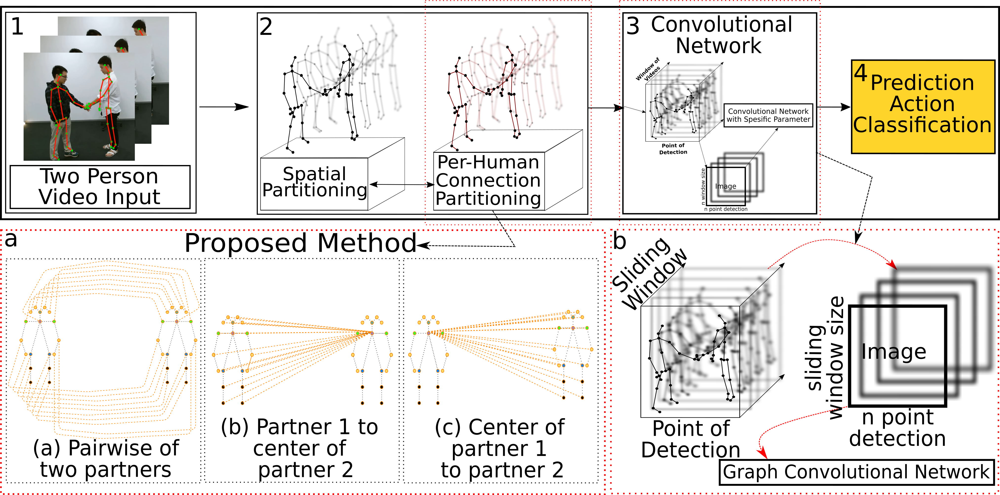

# **Mutual-Action Recognition**
An extended version of ST-GCN [1] for Action Recognition focused on mutual action.

<div align="center">
    
</div>

### Undone
- [ ] Pretrained for CV in PAM Mode
- [ ] Kinetics's Selected Action
- [ ] Kinetics Pretrained


### Requirements and Installation
All of experiment run on dependencies which lied on environment.yml. However, The original version on ST-GCN[1] use the requirements.txt as their dependencies.

- Original ST-GCN dependencies
 - `pip install -r requirements.txt`
 - `cd torchlight; python setup.py install; cd ..`
- Modified dependencies
 - `pip install -r environment.yml`

### Demo

Example : to test model in MA Mode in CS_PP
 ```
main.py recognition -c config/MA_Mode/CS/pp.yaml
```

### Dataset
1. NTURGB+D 120 [2]
2. NTURGB+D 60 [2]
3. Kinetics-Skeleton
4. SBU-Kinect-Interaction dataset v2.0 [3]
5. UT-Interaction Dataset [4]

  We use extracted skeleton model which alredy done by [1]. This data can be downloaded from their repositories : [GoogleDrive](https://drive.google.com/open?id=1SPQ6FmFsjGg3f59uCWfdUWI-5HJM_YhZ) or [BaiduYun](https://pan.baidu.com/s/1dwKG2TLvG-R1qeIiE4MjeA#list/path=%2FShare%2FAAAI18%2Fkinetics-skeleton&parentPath=%2FShare)

### Result
**A. NTURGB+D 120**

| Model      |Mode| CS     | CV    |
| -----------| -- |:------:| -----:|
| PP Matrix  | MA | 80.17  | 86.56 |
| CP Matrix  | MA | 78.93  | 82.87 |
| PCP Matrix | MA | 83.28  | 88.36 |
| PAM         | MH | 82.1   | 80.91 |
| PAM         | AD | 73.87  | 76.85 |
> PP=Pairwise of two partners; CP=partner-1 to the center of partner-2 and vice versa; PCP  use both PP and CP; MA = trained and tested on mutual actions only.
> MH = Tested on mutual action subset only; AD=Tested on all actions label, *PCP

**B. SBU-Kinect-Ineteraction**

|     Test Model    |FOLD 1| FOLD2  |FOLD 3 |FOLD 4|FOLD 5| Average |
| :-----------------| --   |:------:| -----:|------|------| --------|
| TOP 1 Accuration  |93.10%| 98.53  | 94.21%|91.47%|98.53%| 94.6%   |
| TOP 5 Accuration  | 100% | 100%   | 100%  |100%  |100%  |100%     |

**C. UT-Interaction Dataset**   


### Reference
[1] Spatial Temporal Graph Convolutional Networks for Skeleton-Based Action Recognition, Sijie Yan and Yuanjun Xiong and Dahua Lin  
[2] http://rose1.ntu.edu.sg/datasets/actionrecognition.asp  
[3] https://www3.cs.stonybrook.edu/~kyun/research/kinect_interaction/index.html   
[4] Semantic Description of Human Activities, http://cvrc.ece.utexas.edu/SDHA2010/Human_Interaction.html

## Contact
For any question, feel free to contact
```
Aji   : m10715805@mail.ntust.edu.tw
```
